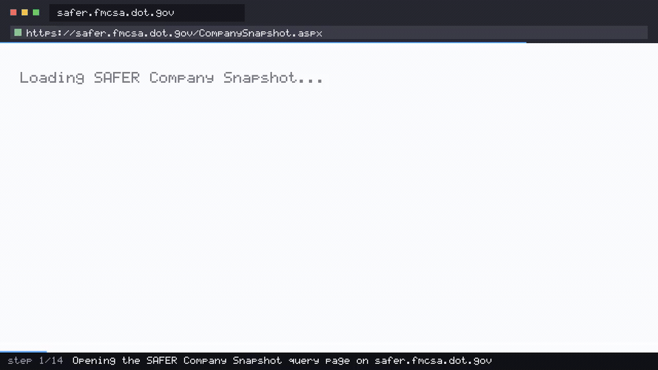

<div align="center">

# 🚚 Logistics Carrier Screen

**An AI agent that opens the federal SAFER register, reads a motor carrier's authority and safety record, and reports back — then films itself doing it.**

[](https://github.com/coasty-ai/coasty-logistics-carrier-screen/actions/workflows/ci.yml)
[](https://nodejs.org)
[](package.json)
[](#try-it-in-30-seconds)
[](LICENSE)



<sub>The clip above is rendered by the **bundled offline mock**, so a fresh clone has a hero with no key and no spend. Run `npm run demo` against live Coasty and the same pipeline rebuilds it from the run's own model-input frames — the exact images the model saw.</sub>

</div>

---

- **Zero dependencies.** No `npm install`, no lockfile, no supply chain — pure Node built-ins.
- **Runs offline for $0.** No API key, no account. A bundled in-process mock runs the full agent loop on a fresh clone.
- **The demo video renders itself.** The frames come straight out of the run — against live Coasty they are the model's own input frames, so there is no storyboard that can drift.

## What this is

A complete, runnable [Coasty](https://coasty.ai) computer-use automation for **motor-carrier safety screening**. Before a broker tenders a load or a shipper onboards a new carrier, somebody has to check that the carrier actually exists, is authorised to operate, and is not out of service. That check lives on a public government site, and it is done by hand — one carrier at a time, a clerk copying the same handful of fields into a spreadsheet.

It gives an AI agent one goal in plain English, and the agent drives a real browser on a real cloud desktop to accomplish it — no selectors, no scraping rules, no DOM parsing to maintain. That matters more here than on most targets: SAFER is a decades-old government application with no public JSON API for this view, and a scraper pinned to its markup is one redesign away from silently returning nothing. An agent reading the page the way a compliance clerk reads it does not care where the fields moved to.

**Zero dependencies. Runs offline for $0 on a fresh clone. ~$0.70 to run for real.**

```
"Go to https://safer.fmcsa.dot.gov/CompanySnapshot.aspx and look up the
 motor carrier whose USDOT number is 264184. From the company snapshot
 returned for that carrier, record the legal name, the DBA name if one is
 listed, the entity type, the USDOT status, the number of power units, and
 the number of drivers. Record the carrier safety rating and its rating
 date as well, or state plainly that no rating is shown if the snapshot
 does not list one. Then report those values as a single labelled list,
 confirming that the USDOT number on the snapshot you read is 264184. If
 SAFER returns a Record Not Found page for that number, report that and
 stop rather than searching for another carrier."
```

That prompt *is* the automation. When the site redesigns, the prompt still works. Point it at a different USDOT number and it is a different screening; nothing else changes.

## Try it in 30 seconds

No API key. No account. No install. No spend.

```bash
git clone https://github.com/coasty-ai/coasty-logistics-carrier-screen
cd coasty-logistics-carrier-screen
npm start
```

That boots a bundled offline mock in-process and runs the whole agent loop against it. Then render the demo video from the run's own frames:

```bash
npm run demo     # needs ffmpeg; writes media/demo.mp4 + demo.gif + poster.jpg
```

Check your setup any time with `npm run doctor`.

## Run it for real

```bash
export COASTY_API_KEY=sk-coasty-test-...      # sandbox keys never bill
export COASTY_BASE_URL=https://coasty.ai/v1
export COASTY_ALLOW_LIVE=1                     # destination consent
npm start -- --live --confirm-cost-cents 120   # cost consent
```

Both consents are required and they are deliberately separate. A live key alone will not spend; a base URL alone will not spend. See [Safety](#safety).

| | |
|---|---|
| Expected cost | **70¢** (14 steps × 5 credits) |
| Worst case | **120¢** (24-step cap) |
| Model-input frames | **free** |
| Machine runtime | Coasty provisions and destroys its own VM |

`npm run estimate` prints this before anything runs.

SAFER is a public federal register — no login, no key, no cookie. This automation reads one carrier snapshot per run and stops.

## How it works

```
POST /v1/tasks                          Coasty provisions its own ephemeral VM,
                                        drives the agent, and destroys the VM
GET  /v1/runs/{id}                      poll to a terminal state
GET  /v1/runs/{id}/screenshots          the exact frames the model saw — free
GET  /v1/runs/{id}/events               per-step narration (SSE)
ffmpeg                                  frames → demo.mp4 + demo.gif + poster
```

The demo video is a **byproduct of running the automation**, not a separate artifact to author and keep in sync. There is no storyboard, no HTML mock, and nothing that can drift from reality — if the agent did something different, the video shows something different. For a compliance check that is not a nice touch, it is the audit trail: the frames are what the agent read before it reported a carrier's operating status.

Verification is intrinsic and runs without a human watching:

```
✓ frames captured              14 frames
✓ frame count matches steps    14 frames vs 14 steps
✓ not all frames degraded      0 degraded
✓ frames are distinct          14/14 unique
✓ duration matches pacing      9.60s vs 9.60s expected
✓ stream width correct         1280x720
✓ video is non-trivial         288 packets
```

## Safety

This repo is built so that **accidental spend is structurally impossible**, not merely discouraged:

- **Fail-closed destination.** An unset `COASTY_BASE_URL` resolves to the bundled offline mock. Production is never a default.
- **Two independent consents.** `COASTY_ALLOW_LIVE=1` authorises the *destination*; `--confirm-cost-cents N` authorises the *cost*, and N must equal the server-computed worst case exactly.
- **Idempotency by default.** The submit key is derived from the prompt, so a retried submit returns the original run instead of provisioning a second machine.
- **A hard cap per unit.** A worst case above `capCents` in [`automation.json`](automation.json) is refused before any request is made.
- **No credentials, ever.** This automation targets a public site. Nothing here reads a password, a token, or a cookie.

## Project layout

```
automation.json      the entire unit definition — prompt, target, budget, caps
src/client.mjs       Coasty client: fail-closed target, retry, idempotency
src/capture.mjs      model-input frames → mp4/gif/poster, with sanity checks
src/cli.mjs          run · demo · estimate
tools/mock.mjs       the bundled offline Coasty (real 1280×720 PNG frames)
tools/doctor.mjs     preflight
test/                36 tests, zero dependencies, fully offline
```

Adding a new automation is one `automation.json` and one prompt — `src/` never forks. See [AGENTS.md](AGENTS.md) for the authoring contract used by Claude Code and Codex.

## Tests

```bash
npm test     # node --test, no install, no network, no key
```

## Related

Part of the **Coasty automation catalog** — computer-use automations across 12 industries. See [the index](https://github.com/coasty-ai) for retail, finance, healthcare, legal, energy, public sector, HR, education, manufacturing, nonprofit and e-commerce.

- [Coasty docs](https://coasty.ai/docs) · [API reference](https://coasty.ai/docs/llms.txt)
- [computer-use-cookbook](https://github.com/coasty-ai/computer-use-cookbook) — the API, by endpoint, in 4 languages
- [open-cowork](https://github.com/coasty-ai/open-cowork) — the open-source AI coworker

## License

MIT © Coasty
